# EXT4

## Пункт 1.
* Открыть в программе WinHex образ диска (файл Ubuntu 20.04 ext4-flat.vmdk) с файловой системой ext4 («File»  «Open…» в главном меню) от виртуальной машины «Ubuntu 20.04 ext4».
## Пункт 2.
* С использованием меню «Navigation»  «Go To Offset…» сместиться на значение 100000h к началу раздела. Определить начало суперблока. Почему основной суперблок смещен на 1024 байта?
* 0x400=1024

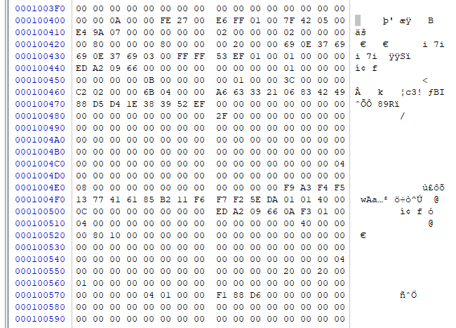


## Пункт 3.
* Изучить значения параметров в суперблоке (табл. 2) и заполнить таблицу :

| № п/п	    | Параметр	                                    | Значение |
|-----------|-----------------------------------------------|----------|
| 1.		| Размер логического блока (в байтах)	        | 0x18 = `02 00 00 00` |
| 2.		| Число блоков в каждой группе блоков	        | 0x20 = `00 80 00 00` |
| 3.		| Число индексных узлов в каждой группе блоков  | 0x28 = `00 20 00 00` |
| 1.        | Дата и время последнего монтирования файловой системы	| 0x2C = `69 0e 37 69` |
| 2.        | Размер inode	                                        | 0x58 = `00 01` |
| 3.        | UUID раздела 	                                        | 0x68 = `a6 63 33 21 06 83 42 49` |
| 4.        | Метка тома 	                                        | 0x78 = `00 00 00 00 00 00 00 00` |
| 5.        | Полный путь до директории монтирования	            | 0x88 = `2f 00 00 00 00 00 00 00` |
| 6.        | Дата и время создания файловой системы	            | 0x108 = `ed a2 09 66 0a f3 01 00` |
| 7.        | Размер гибкой группы блоков	                        | 0x174 = `04` |

## Пункт 4.
* Изучить структуру inode (табл. 4), расположенного по смещению 423C00h от начала раздела и заполнить таблицу:

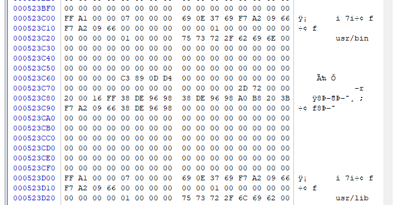

| № п/п	    | Параметр	                                                                        | Значение | 
|---------- | --------------------------------------------------------------------------------- | -------- |    
| 1.		| Тип файла 	                                                                    | 0x0 = `ff a1` |
| 2.		| Права доступа к файлу	                                                            | 0x0 = `ff a1` |
| 3.		| Младшие значащие биты идентификатора вла-дельца	                                | 0x2 = `00 00` |
| 4.		| Размер файла в байтах	                                                            | 0x4 = `07 00 00 00` |
| 5.		| Дата и время последнего доступа к файлу 	                                        | 0x8 = `69 0e 37 69` |
| 6.		| Дата и время последнего изменения inode	                                        | 0xC = `f7 a2 09 66` |
| 7.		| Дата и время последнего изменения содержимого файла 	                            | 0x10 = `f7 a2 09 66` |
| 8.		| Дата и время удаления файла 	                                                    | 0x14 = `00 00 00 00` |
| 9.		| Количество жестких ссылок (имен) файла	                                        | 0x1A = `00 01` |
| 10.		| Карта блоков (HEX-значения)	                                                    | 0x28 = `75 73 72 2f 62 69 6e 00` |
| 11.		| Диапазон дат временной метки последнего доступа к файлу (табл. 5)                 |  |
| 12.		| Диапазон дат временной метки последнего изме-нения inode (табл. 5)	            | 0x84 = `38 de 96 98` |
| 13.		| Диапазон дат временной метки последнего изме-нения содержимого файла (табл. 5)    | 0x88 = `38 de 96 98` |	
| 14.		| Дата и время создания файла	                                                    | 0x90 = `f7 a2 09 66` |
| 15.		| Диапазон дат временной метки создания файла (табл. 5)	                            | 0x94 = `38 de 96 98` |


## Пункт 5.
* Найти упоминание в содержимом каталога файла с именем «small_file.txt» с помощью меню «Search»  «Find Text…». Определить номер его индексного узла (табл. 9).

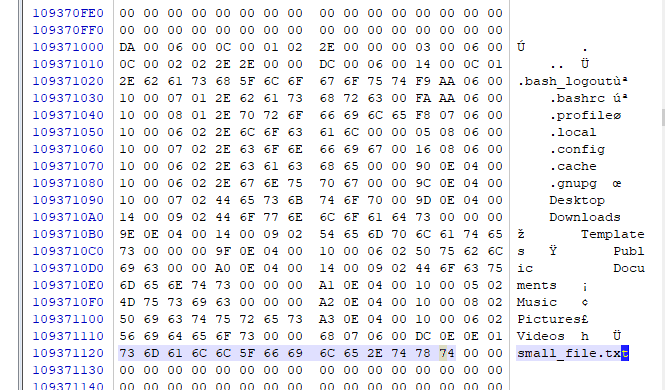

## Пункт 6.
* Определить группу блоков, которой принадлежит этот inode по формуле bgnum = (inum – 1) / ipg.
* inum = `da 00 06 00`
* ipg = 8192
* bgnum = (393434 - 1) / 8192 = 0xc01b = 48.0264892578

## Пункт 7.
* Определить смещение от начала раздела найденной группы блоков по формуле bgoff = bgnum * bs * bpg. С чего начинается указанная группа блоков? Почему?
* bgoff = 48 * 4096 * 32768 = 6 442 450 944 = 0x180000000
* битовая карта

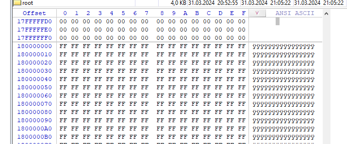

## Пункт 8.
* Пропустить битовые карты, сместившись от начала группы блоков на gbpfgb*bs*(bbmbpg+ ibmbpg) байт с помощью меню «Navigation»  «Go To Offset…». Какая структура файловой системы расположена по полученному смещению?
* 16 * 4096 * (1+1) = 20000h
* 0x180020000

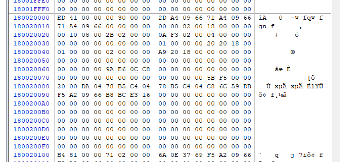

## Пункт 9.
* Рассчитать смещение inode ioff в таблице inode по формулам idx = (inum – 1) % ipg и ioff = idx * isize. 
* idx = (395112 - 1) % 8129 = 1895
* ioff = 1895 * 256 = 0x76700

## Пункт 10.
* Изучить inode, определить адреса блоков с данными из дерева экстентов используя табл. 6 и табл. 8. 
* 0x180020000 + 0x76700 = 0x180096700

Заголовок дерева
* 0x0 -> сигнатура `0A F3`
* 0x2 -> фактическое количество записей -> `01 00`
* 0x4 -> макс. количество записей -> `04 00`
* 0x6 -> глубина узла -> `00 00`

узел дерева
* 0x00 -> Адрес начального блока данных `01 00 00 00`
* 0x04 -> Младшие значащие биты номера блока узла дерева, расположенно-го уровнем ниже -> `e5 a8 18 00`

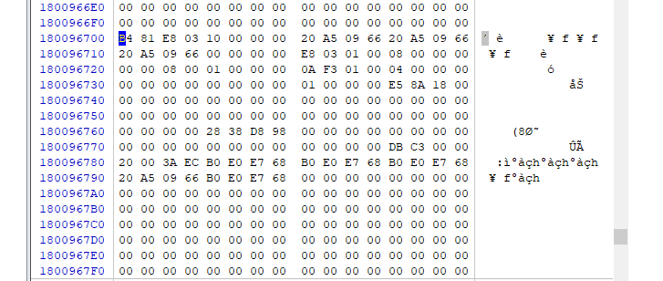

## Пункт 11.
* Прочитать и зафиксировать содержимое файла.
* 0x00188ae5000

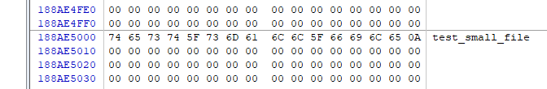

## Пункт 12.
* Найти упоминание в содержимом каталога файла с именем «huge_file.txt» с помощью меню «Search»  «Find Text…». Определить номер его индексного узла (табл. 9). 

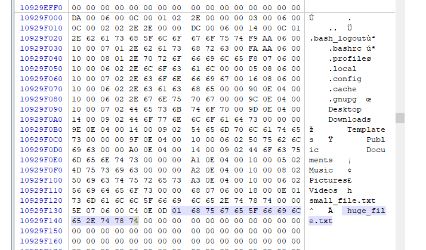

## Пункт 13.
* Определить группу блоков, которой принадлежит этот inode по формуле bgnum = (inum – 1) / ipg.
* inum = `da 00 06 00`
* ipg = 8192
* bgnum = (393434 - 1) / 8192 = 0xc01b = 48.0264892578

## Пункт 14.
* Определить смещение от начала раздела найденной группы блоков по формуле bgoff = bgnum * bs * bpg. С чего начинается указанная группа блоков? Почему?
* bgoff = 48 * 4096 * 32768 = 6 442 450 944 = 0x180000000
* битовая карта

## Пункт 15.
* Пропустить битовые карты, сместившись от начала группы блоков на gbpfgb*bs*(bbmbpg+ ibmbpg) байт с помощью меню «Navigation»  «Go To Offset…». Какая структура файловой системы расположена по полученному смещению?
* 16 * 4096 * (1+1) = 20000h
* 0x180020000

## Пункт 16.
* Рассчитать смещение inode ioff в таблице inode по формулам idx = (inum – 1) % ipg и ioff = idx * isize. 
* idx = (395 102 – 1) % 8 192 = 1885
* ioff = 1885 * 256 = 482 560 = 75D00h

## Пункт 17.
* Изучить inode, определить глубину дерева экстентов. Убедиться, что без дополнительных средств автоматизации переводить дерево экстентов в блоки с данными – пустая трата времени.
* 0x180020000 + 0x75D00 = 0x180095d00
Заголовок дерева
* 0x0 -> сигнатура `0A F3`
* 0x2 -> фактическое количество записей -> `01 00`
* 0x4 -> макс. количество записей -> `04 00`
* 0x6 -> глубина узла -> `01 00`

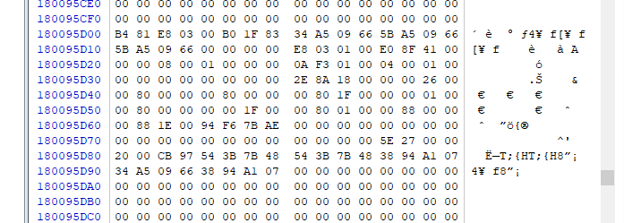

## Пункт 18.
* Открыть виртуальную машину «Ubuntu 20.04 ext4». В настройках виртуальной машины добавить ISO-образ «slax-64bit-9.4.0.iso» в привод CD/DVD. Запустить виртуальную машину «Ubuntu 20.04 ext4». При отсутствии загрузочного носителя проверить подключение ISO-образа Slax. Открыть терминал в главном меню.

## Пункт 19.
* Командой lsblk проверить канал подключения виртуального диска с разделом, отформатированным в ext4, например sdb1.

```shell
lsblk /dev/sda1
stat <395102>
```

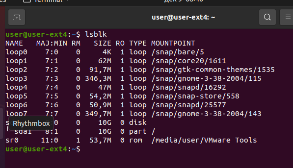

## Пункт 20.
* Командой debugfs /dev/sdb1 открыть исследуемый раздел с ext4. Командой stat <inum>1, вывести содержимое inode файла с именем huge_file.txt. Каков размер файла в байтах? 

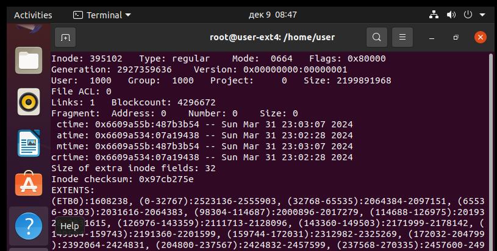


## Пункт 21.
* Проанализировать список экстентов. Найти 17 экстент и указать номер начального блока. Сколько блоков представлено в экстенте? 
* Данные 17-го экстента: (344064-345783):1331021-1332740
* Начальный логический блок: 344064
* адрес начального блока экстента: 1331021
* количество блоков в экстенте: 345783 − 344064 + 1 = 1720

## Пункт 22.
* Открыть еще один терминал из главного меню. На втором терминале командой dd if=/dev/sdb1 bs=<bs> skip=<адрес начального блока экстента> count=<количество блоков в экстенте> | xxd считать 17 экстент. Какая строка повторяется в файле? 

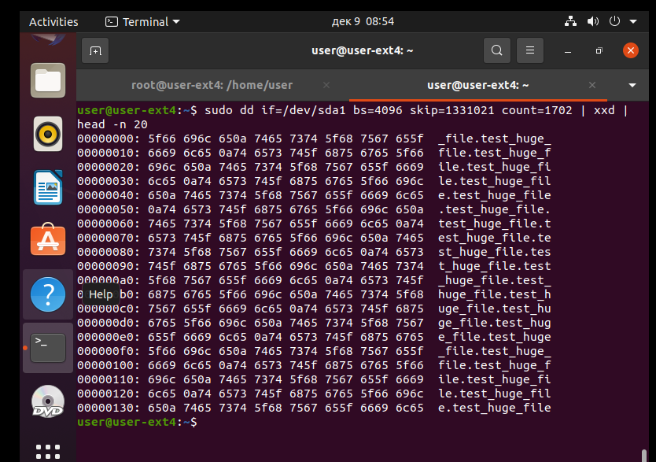

## Пункт 23.
* Закрыть debugfs командой quit. Выключить виртуальную машину «Ubuntu 20.04 ext4» командой poweroff. Отключить привод CD/DVD и вновь запустить виртуальную машину «Ubuntu 20.04 ext4». 
## Пункт 24.
* Авторизоваться пользователем «user» с паролем «12345». 
## Пункт 25.
* Открыть LibreOffice Writer добавить фигуру на всю площадь страницы из меню «Insert»  «Shape»  «Symbol Shapes»  «Puzzle». Фон фигуры «Color» заменить на «Coffee Beans».

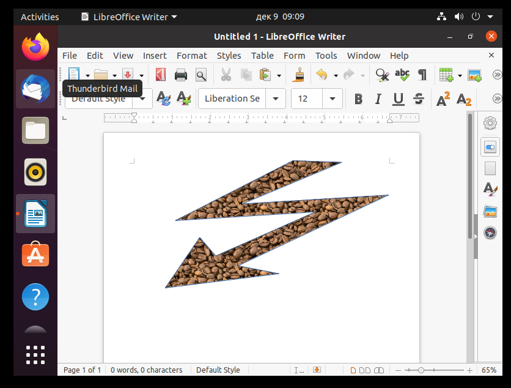

## Пункт 26.
* Экспортировать документ в PDF через меню «File»  «Export As»  «Export Directly as PDF» с произвольным именем. Закрыть LibreOffice Writer без сохранения.
## Пункт 27.
* Открыть экспортированный PDF и в меню правой кнопки мыши выбрать «Save Image As». Сохранить файл в формате Bitmap с именем «сoffee.bmp». Закрыть просмотр PDF.
## Пункт 28.
* Открыть терминал. Командой ls -li ~/Pictures/coffee.bmp определить и запомнить номер inode созданного рисунка. Командой md5sum посчитать и зафиксировать контрольную сумму файла. Выключить виртуальную машину «Ubuntu 20.04 ext4». Подключить привод CD/DVD.

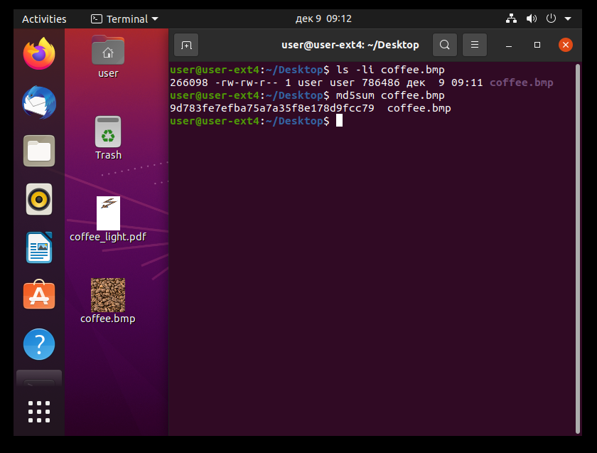

## Пункт 29.
* Запустить виртуальную машину «Ubuntu 20.04 ext4». При отсутствии загрузочного носителя проверить подключение ISO-образа Slax. Открыть терминал в главном меню.
## Пункт 30.
* Командой lsblk проверить канал подключения виртуального диска с разделом, отформатированным в ext4, например sdb1.
## Пункт 31.
* Командой debugfs /dev/sdb1 открыть исследуемый раздел с ext4. Командой stat <inum>, вывести содержимое inode рисунка «coffee.bmp». Каков размер файла в байтах?

```shell
debugfs /dev/sda1
stat <266098>
```

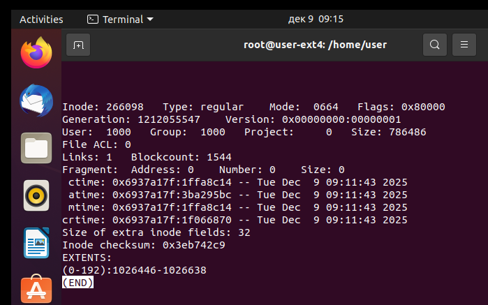

## Пункт 32.
* Проанализировать список экстентов, зафиксировать адрес начального блока экстента и количество блоков в экстенте.
## Пункт 33.
*  Открыть еще один терминал из главного меню. На втором терминале командой dd if=/dev/sdb1 of=/root/coffee_r.bmp bs=<bs> skip=<адрес начального блока экстента> count=<количество блоков в экстенте>. Является ли полученное изображение копией содержимого исходного файла «coffee.bmp»? Сравнить размеры изображений, объяснить полученный результат.

```shell
dd if=/dev/sda1 of=/home/user-ext4/Desktop/coffe_r.bmp bs=4096 skip=1026446 count=193
```

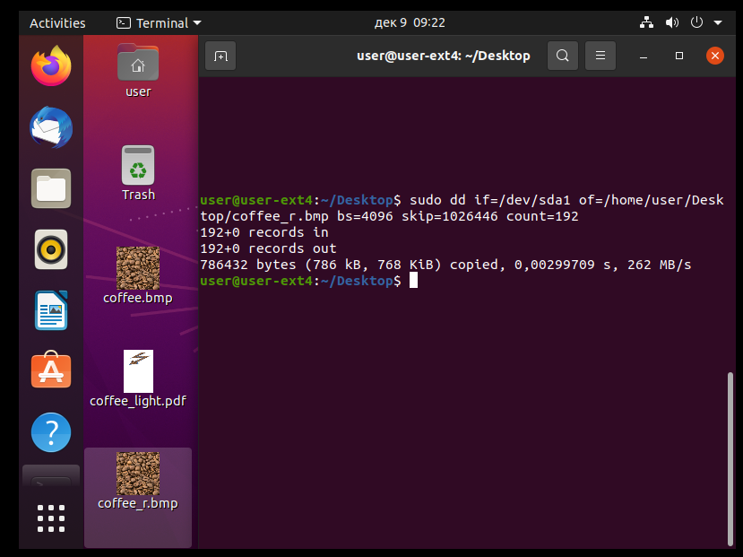

## Пункт 34.
* Скорректировать размер копии путем отсечения лишних данных командой dd if=/root/coffee_r.bmp of=/root/coffee_ok.bmp bs=<размер исходного coffee.bmp> count=1. Командой md5sum посчитать контрольную сумму файла coffee_ok.bmp и сравнить с ранее посчитанной. 

```shell
dd if=/home/user-ext4/Desktop/coffe_r.bmp of=/home/user-ext4/Desktop/coffe_ok.bmp bs=786486 count=1
```

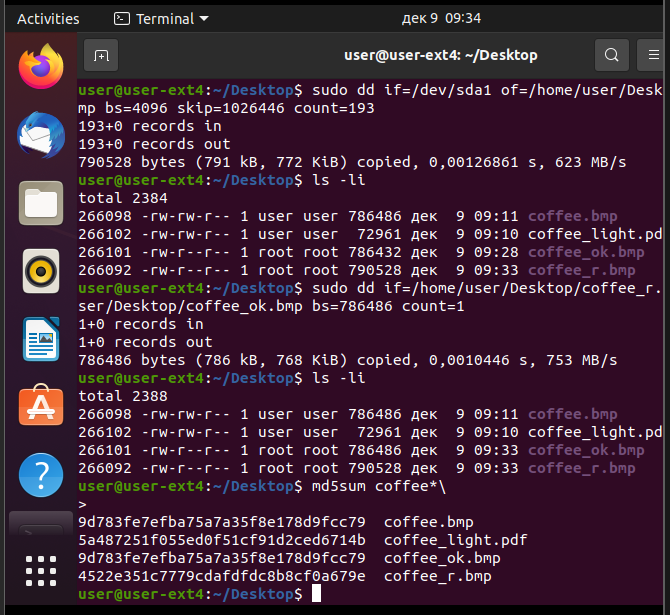

## Пункт 35.
* Закрыть debugfs командой quit.
## Пункт 36.
* Смонтировать на запись раздел sdb1 в каталог mnt командой mount /dev/sdb1 /mnt.
## Пункт 37.
* Зафиксировать номер inode файла coffee.bmp командой ls -li /mnt/home/user/Pictures/coffee.bmp.
## Пункт 38.
* Командой rm /mnt/home/user/Pictures/coffee.bmp удалить изображение.

```
ls -li coffee.bmp
rm coffee.bmp
```

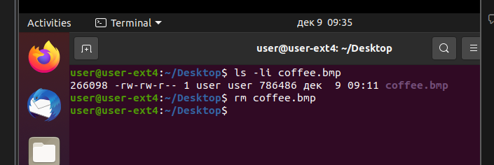

## Пункт 39.
* Командой debugfs /dev/sdb1 открыть исследуемый раздел с ext4. Командой stat <inum>, вывести содержимое inode рисунка «coffee.bmp». Какая информация изменилась в inode после удаления файла? Получится ли теперь восстановить данные?

```shell
debugfs /dev/sda1
stat <266098>
```

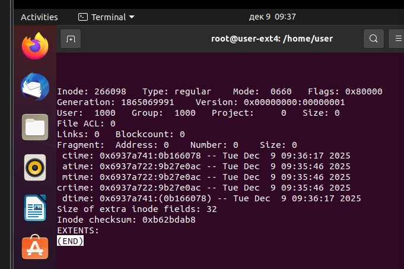

Изменения:
1) Размер файла -> 0
2) Счетчик ссылок -> 0
3) Время изменения содержимого / изменения inode / последнего доступа = время удаления
4) Блоки файла -> 0
5) Список экстeнтов -> освобождается
6) Контрольная сумма inode

## Пункт 40.
* Закрыть debugfs командой quit. Выключить виртуальную машину «Ubuntu 20.04 ext4» командой poweroff.
## Пункт 41.
* Попытаться восстановить удаленный файл с использованием программы R-Studio. Получилось ли это? Корректно ли восстановлены файлы?