# XFS

## Пункт 1.	
* Открыть в программе WinHex образ диска (файл Ubuntu 20.04 xfs-flat.vmdk) с файловой системой XFS («File»  «Open…» в главном меню) от виртуальной машины Ubuntu 20.04 xfs.

## Пункт 2.
* С использованием меню «Navigation»  «Go To Offset…» сместиться на значение 100000h к началу раздела, определить начало суперблока.

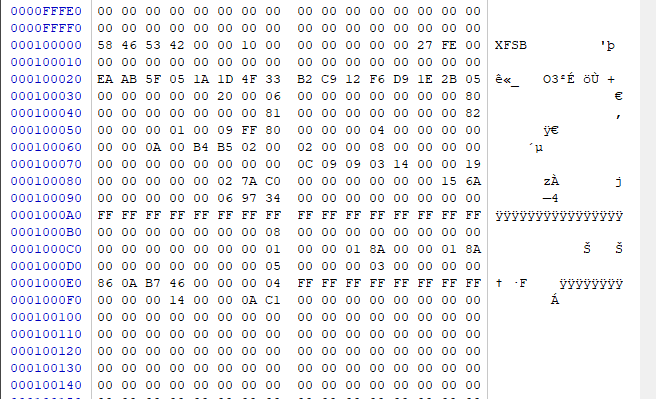

## Пункт 3.
* Изучить значения параметров в суперблоке (табл. 1) и заполнить таблицу:

| № п/п 	| Параметр                                  | Значение |
|-----------|-------------------------------------------|----------|
| 1.		| Размер блока в байтах 	                | `00 00 10 00` | 
| 2.		| Количество блоков в файловой системе	    | `00 00 00 00 00 27 FE 00` |
| 3.		| UUID файловой системы	                    | `EA AB 5F 05 1A 1D 4F 33 B2 C9 12 F6 D9 1E 2B 05` |
| 4.		| Номер inode корневого каталога	        | `00 00 00 00 00 00 00 80` |
| 5.		| Размер (в блоках) группы размещения (AG)	| `00 09 FF 80` |
| 6.		| Количество групп размещения (AG)	        | `00 00 00 04` |
| 7.		| Размер сектора 	                        | `02 00` |
| 8.		| Размер inode 	                            | `02 00` |
| 9.		| Количество inode в одном блоке	        | `00 08` |
| 10.		| log2(количество inode в одном блоке)	    | `03` |
| 11.		| log2(размер AG)	                        | `14` |

## Пункт 4.	
* Изучить структуру inode (табл. 4), расположенного по смещению 10E00h от начала раздела

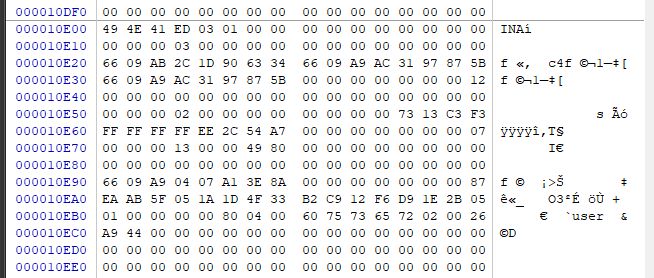

* Заполнить таблицу:

| № п/п	    | Параметр	                                                | Значение |
|-----------|-----------------------------------------------------------|----------|
| 1.		| Тип файла 	                                            | `4` |
| 2.		| Права доступа к файлу	                                    | `1 ED` |
| 3.		| Количество жестких ссылок (имен) файла	                | `00 00 00 00` |
| 4.		| Идентификатор владельца	                                | `00 00 00 00` |
| 5.		| Размер файла в байтах	                                    | `00 00 00 00 00 00 00 12` |
| 6.		| Дата и время последнего доступа к файлу 	                | `66 09 AB 2C` |
| 7.		| Дата и время последнего изменения содержимого файла	    | `66 09 A9 AC` |
| 8.		| Дата и время последнего изменения inode	                | `66 09 A9 AC` |
| 9.		| Дата и время создания файла 	                            | `66 09 A9 04` |
| 10.		| Номер текущего индексного узла	                        | `00 00 00 00 00 00 00 87` |
| 11.		| Тип хранения данных в разделе индексного узла с данными	| `02` |


## Пункт 5.
* Изучить структуру inode (табл. 4), расположенного по смещению 10A00h от начала раздела

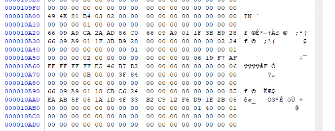

* Заполнить таблицу:

| № п/п	    | Параметр	                                                | Значение |
|-----------|-----------------------------------------------------------|----------|
| 1.		| Тип файла 	                                            | `8` |
| 2.		| Права доступа к файлу	                                    | `1 B4` |
| 3.		| Количество жестких ссылок (имен) файла	                | `00 00 00 01` |
| 4.		| Идентификатор владельца	                                | `00 00 00 00` |
| 5.		| Размер файла в байтах	                                    | `00 00 00 00 00 00 02 24` |
| 6.		| Дата и время последнего доступа к файлу 	                | `66 09 A9 CA` |
| 7.		| Дата и время последнего изменения содержимого файла	    | `66 09 A9 01` |
| 8.		| Дата и время последнего изменения inode	                | `66 09 A9 01` |
| 9.		| Дата и время создания файла 	                            | `66 09 A9 01` |
| 10.		| Номер текущего индексного узла	                        | `00 00 00 00 00 00 00 85` |
| 11.		| Тип хранения данных в разделе индексного узла с данными	| `02` |

* Что находится в содержимом файла? 

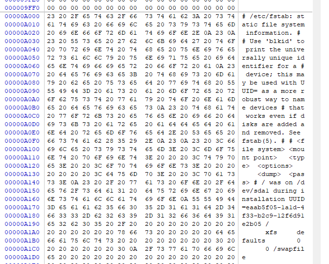

## Пункт 6.
* Найти упоминание в содержимом каталога файла с именем «small_file.txt» с помощью меню «Search»  «Find Text…». 
* Определить номер его индексного узла (табл. 4).
* `00 00 00 A3 B8 00 00 01`

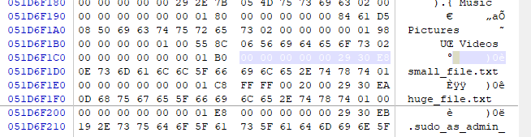

## Пункт 7.
* Рассчитать смещение inode согласно методике выше. 
* Количество значащих бит = logipg + logapsize = 23
* inode = `00 29 30 E8` = `0000 0000 0010 1001 0011 0000 1110 1000`
* ruinum = `010 1001 0011 0000 1110 1000`
* ioff = agnum * bs * agsize + ruinum * isize = `5261D000`

## Пункт 8.	
* Изучить inode, определить адреса блоков с данными согласно табл. 10. 

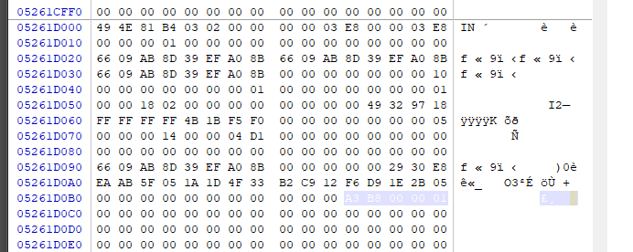

## Пункт 9.	
* Прочитать и зафиксировать содержимое файла. 

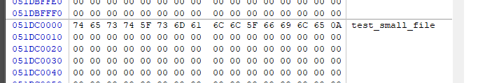

## Пункт 10.	
* Найти упоминание в содержимом каталога файла с именем «huge_file.txt» с помощью меню «Search»  «Find Text…». Определить номер его индексного узла (табл. 4). 

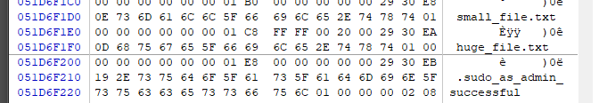

## Пункт 11.	
* Рассчитать смещение inode согласно методике выше. 
* ioff = `00 00 00 00 00 29 30 EA` * 512 = `5261D400`

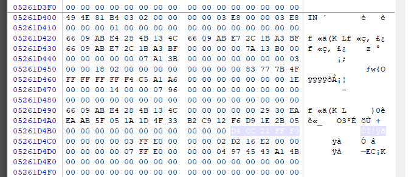

## Пункт 12.	
* Изучить inode, определить указатель на первый экстент согласно табл. 10. 
* `D4 CC 21 FF F0` = `1101 0100 1100 1100 001|0 0001 1111 1111 1111 0000`
* количество блоков = `0 0001 1111 1111 1111 0000`
* номер блока = `1101 0100 1100 1100 001` 
* смещение = `6A66100`
		
## Пункт 13.
* Прочитать и зафиксировать повторяющееся содержимое файла из первого блока. 

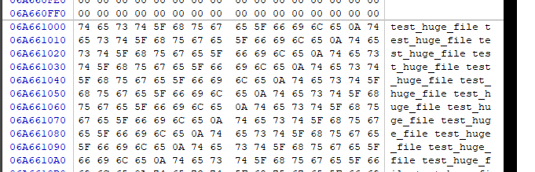

## Пункт 14.
* Открыть виртуальную машину «Ubuntu 20.04 xfs». В настройках выбрать «CD/DVD» привод и подключить образ «ubuntu-20.04.5-desktop-amd64.iso». 

## Пункт 15.
* Запустить виртуальную машину «Ubuntu 20.04 xfs» в BIOS через меню «VM»  «Power»  «Power On to Firmware». В BIOS открыть меню «Boot» и выставить элемент списка «CD/DVD» на первое место. Выйти из BIOS с сохранением настроек и загрузить ISO-образ операционной системы Ubuntu. 

## Пункт 16.
* В появившемся окне выбрать «Try Ubuntu» и через меню приложений открыть Terminal. Ввести команду sudo su. 

## Пункт 17.
* Открыть раздел с xfs командой xfs_db -r /dev/sda1.

```shell
sudo xfs_db -r /dev/sda1
```

## Пункт 18.
* Командой inode 2699498 считать исследуемый inode и командой p вывести значения его полей.
* Определить оставшиеся экстенты. 

```shell
inode 2699498
p
q
```

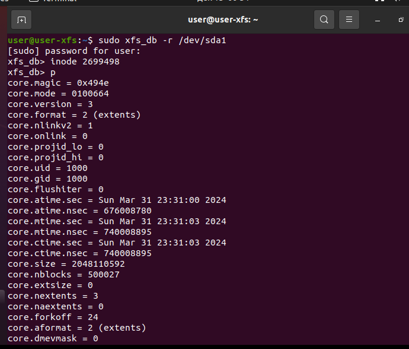

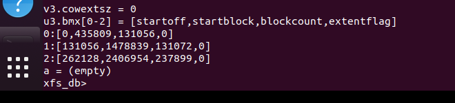

## Пункт 19.
* Командой quit завершить работу xfs_db, в меню «VM»  «Removable Devices»  «CD/DVD» выбрать «Disabled».
* Перезагрузить виртуальную машину.

## Пункт 20.
* Авторизоваться пользователем «user» с паролем «12345». 

## Пункт 21.
* Создать текстовый файл произвольного имени и содержания.
* Командой rm удалить вновь созданный файл. 
* Командой rm /home/user/huge_file.txt удалить «huge_file.txt»

```shell
echo 'leoned' > say_my_name.txt
rm say_my_name.txt
rm huge_file.txt
shutdown now
```

## Пункт 22.
* Выключить виртуальную машину «Ubuntu 20.04 xfs».

## Пункт 23.
* Попытаться восстановить удаленные файлы с использованием программы R-Studio. Получилось ли это? Корректно ли восстановлены файлы?
 
* inode huge_file.txt на месте, но в битмапе помечена как свободная

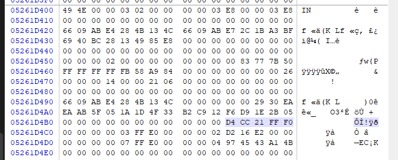

* Содержимое тоже на месте

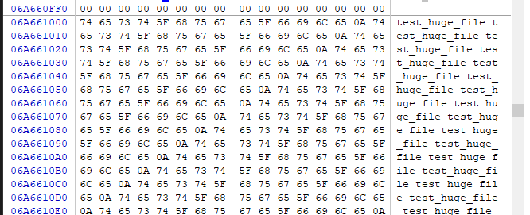